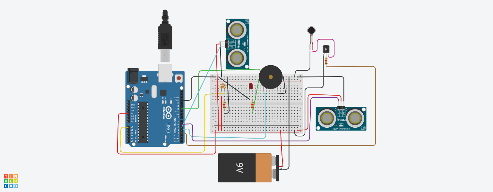

# Smart-Blind-Stick
An IOT based project which helps mountaineers or blind people to detect the obstacles in their path. A simulator based project.
It is developed on IOT simulator named Tinkercad. We can transform the same to original Hardware Components.

## ABSTRACT
Obstacle detection is one of the major concerns for a fully or a partially blind person (e.g. person suffering from night-blindness, cataracts, glaucoma, albinism or injury) which is a condition without the visual insight because of physiological or neurological factors. The fractional visual impairment addresses the absence of joining in the development of the optic nerve or visual focus of the eye and all out visual deficiency is the full shortfall of the visual light discernment . Envision strolling into a new spot. One needs to request direction in order to reach the objective.  By and large we see that the stick is the closest companion of an outwardly debilitated individual. Yet, numerous times this stick is not helpful many a times it may cause several accidents if they meet with some obstacles or a hole/pit may obstruct.
Considering all these conditions the project describes a smart blind stick using Arduino Uno. According to the survey of the World Health Organization (WHO), 30 million individuals are for all time visually impaired and 2.85 million individuals with vision disability. They need to confront more battles in their day to day existence everyday life. Utilizing this visually impaired stick, an individual can walk all the more unhesitatingly. The Proposed System identifies the article before the individual as well as it detects the distance from the stick to the ground for detecting any holes on the road which will offer reaction to the client by some different sounds of buzzers with different frequency ranges. For detection of obstacles the stick will have two Ultrasonic sensors which will detect nearby obstacles and notify the user of the direction of that obstacle, thereby enabling the user to determine the corrective direction to head. Many times it happens that the person with visual impairment walks on the road at night but due to the darkness people around them were unable to see them. So, a solution to this problem this project will sense the light around the stick through LDR sensor(LDR for light intensity ) and work accordingly .If the LDR gives a value of less than 200 it is assumed to be very dark then the indication light on the stick will start automatically but if the intensity is very bright (i.e. during daytime) the indicator light will be turned off. This will help other people to know that the visually impaired person is around them. In this way, the individual can stroll with no dread. This gadget will be the best answer to beat their troubles. We will overhaul the task by expanding its application. 
Using this smart blind stick, a visually impaired person can walk without anyone's help. 

